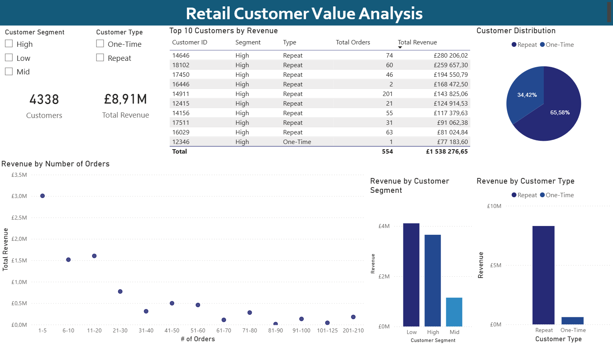
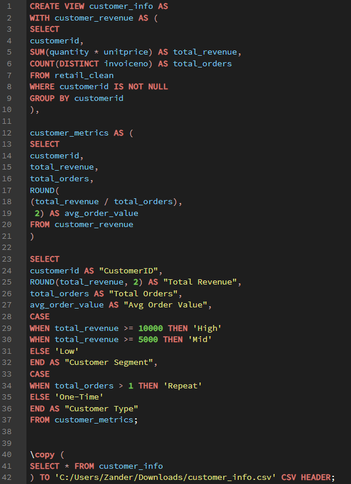
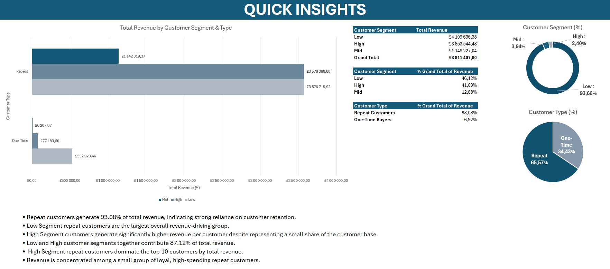
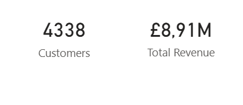
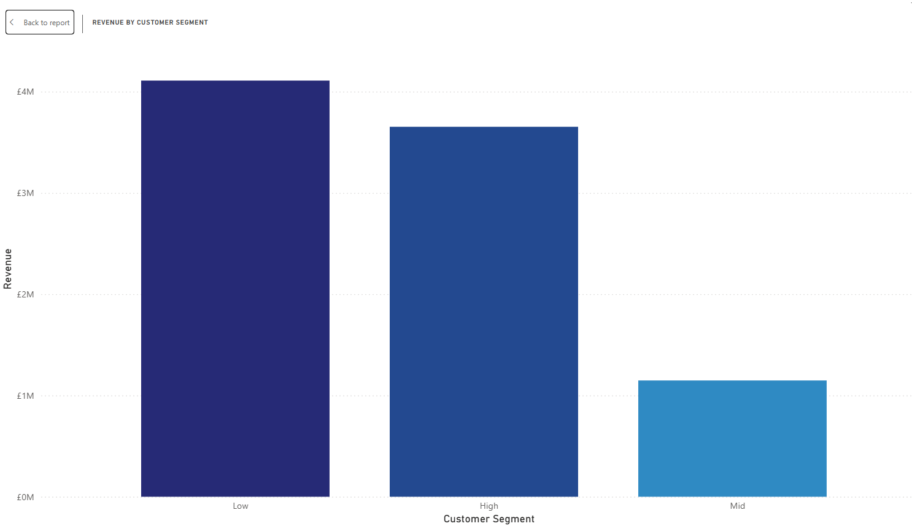
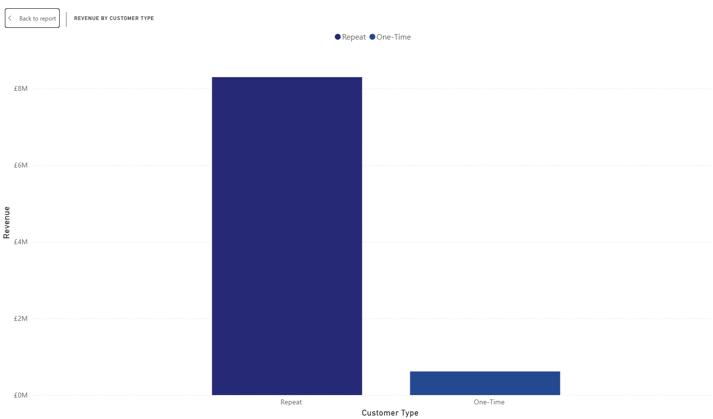
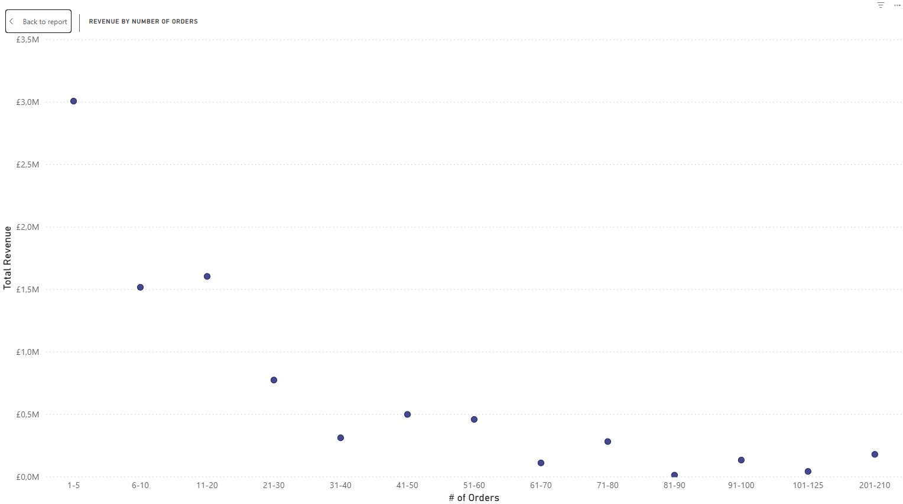
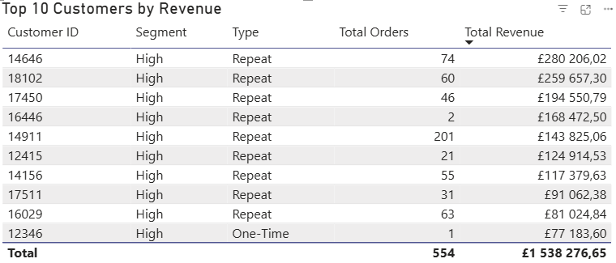
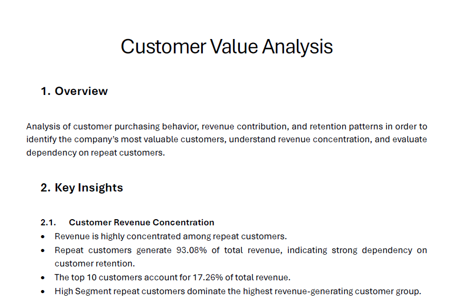

# Customer-Value-Analysis

## Overview

This project analyzes customer purchasing behavior, customer retention, and revenue contribution patterns using SQL, Excel, Power BI, and business reporting techniques.

The objective was to identify:

- The company’s most valuable customers
- Dependency on repeat customers
- Revenue concentration across customer segments
- Customer purchasing behavior patterns
- Opportunities for customer retention and growth optimization

The project follows a full analytics workflow from SQL-based customer aggregation through to dashboarding and executive reporting.

## Tools & Technologies

- PostgreSQL
- Command Prompt Terminal
- SQL
- Ms Excel
- Power BI
- Power Query
- PDF Reporting

PLEASE NOTE:
Customer records containing null CustomerIDs were removed from the analysis as they most likely represented in-house or unidentified purchases which could distort customer-level insights.

---

## Project Workflow

### 1. SQL Data Extraction & Customer Aggregation

The original retail transaction dataset was queried directly from PostgreSQL using SQL views, CTEs, and CASE statements to create a customer-level analytical dataset.

The SQL workflow aggregated:

- Total revenue by customer
- Total orders by customer
- Average order value
- Customer segmentation
- Customer retention classification

### SQL View Used

### SQL Logic Applied

#### Customer Segmentation
Customers were categorized into:

- High Segment → Revenue ≥ £10 000
- Mid Segment → Revenue ≥ £5 000
- Low Segment → Revenue < £5 000

#### Customer Retention Classification
Customers were categorized as:

- Repeat Customers → More than 1 order
- One-Time Buyers → Single order only

### Outcome

- Created a clean customer-level analytical dataset
- Removed null CustomerIDs
- Prepared structured data for Excel analysis & dashboarding

---

### 2. Excel Data Cleaning & Preparation

After exporting the SQL view into CSV format, the dataset was loaded into Excel for exploratory analysis and reporting preparation.

#### Workbook Structure

- Raw Data
- Working Sheet
- Pivot Tables
- Key Values
- Quick Insights

#### Data Preparation Tasks

- Preserved original dataset integrity using a separate working sheet
- Organized dataset structure for readability
- Converted revenue-related columns to numeric formatting
- Standardized decimal formatting to 2 decimal places
- Prepared dataset for pivot table analysis

---

### 3. Exploratory Data Analysis (Excel)

### Pivot Tables Created

#### Revenue by Customer Segment & Customer Type
- Customer Segment
- Customer Type
- Total Revenue

#### Average Order Value by Customer Segment
- Average Order Value
- Total Revenue

#### Average Order Value by Customer Type
- Customer Type
- Average Order Value
- Total Revenue

#### Customer Distribution Analysis
- Count of Customer Types
- Count of Customer Segments

#### Top 10 Customers by Revenue
- CustomerID
- Total Orders
- Total Revenue

---

### Excel Visualizations Created

#### Customer Type Distribution
- Pie Chart
- Displays Repeat vs One-Time customer distribution

#### Customer Segment Distribution
- Donut Chart
- Displays Low, Mid, and High customer segments

#### Revenue by Customer Segment & Type
- Clustered Bar Chart
- Displays revenue contribution across customer segments split by customer type

---

### Business Questions Investigated

- Who are the company’s most valuable customers?
- Does the business rely heavily on repeat customers?
- How is revenue distributed across customer segments?
- What customer purchasing behaviors are most common?
- Which customer groups drive the majority of revenue?

---

### Key Insights Identified

- Repeat customers generate approximately 93.08% of total revenue
- Revenue is heavily dependent on customer retention
- Top 10 customers contribute approximately 17.26% of total revenue
- High Segment customers generate substantially higher revenue per customer
- Low and High customer segments together contribute approximately 87.12% of revenue
- Majority of customers place between 1–5 orders
- High Segment repeat customers dominate the top revenue-generating customer group
- Revenue is concentrated among a relatively small group of loyal customers

---

### 4. Power BI Dashboard Development

The cleaned customer dataset was imported into Power BI for interactive dashboard creation.

#### Power Query Transformations

Additional Power Query transformations were applied to prepare the dataset for dashboard analysis.

#### Data Standardization

- Corrected decimal formatting issues
- Converted Total Revenue & Avg Order Value to Fixed Decimal Number format

#### Custom Columns Created

##### Order Brackets
Custom order-frequency groupings were created to support purchasing behavior analysis within scatter plot visualizations.

Examples:
- 1–5 Orders
- 6–10 Orders
- 11–20 Orders
- 21–30 Orders
- etc.

##### Order Brackets Sort
A numerical sorting column was created to ensure proper sequential ordering within Power BI visualizations.

---

## Dashboard Features

### Interactive Slicers

- Customer Segment
- Customer Type

The slicers dynamically filter:
- KPI Cards
- Scatter Plot
- Top 10 Customer Table

---

### KPI Cards

- Total Customers
- Total Revenue

Both KPI cards dynamically update based on dashboard filtering selections.

---

### Visualizations

#### Revenue by Customer Segment

- Stacked column chart
- Displays revenue contribution across customer segments

#### Revenue by Customer Type

- Pie Chart
- Displays revenue distribution between Repeat and One-Time customers

#### Revenue by Number of Orders

- Scatter Chart
- Displays relationship between order frequency and revenue generation

#### Top 10 Customers by Revenue

- Interactive data table
- Displays:
  - CustomerID
  - Customer Segment
  - Customer Type
  - Total Orders
  - Total Revenue

### Dashboard Insights

- Majority of customers fall within the 1–5 order range
- Customers within the 1–5 order range contribute approximately 33.73% of total revenue
- Top 10 customers account for approximately 17.26% of total revenue
- 9 out of the top 10 customers are repeat buyers
- One exceptionally high-value one-time purchase (£77 183.60) appears as a significant outlier

---

## 5. PDF Business Report

A structured business report was created summarizing:
- Customer retention performance
- Revenue concentration
- Customer segmentation trends
- Purchasing behavior analysis
- Strategic business recommendations

### Key Recommendations

#### Strengthen Customer Retention Strategies
- Implement loyalty programs
- Introduce customer retention incentives
- Expand personalized marketing initiatives
- Improve email remarketing strategies

#### Develop High-Value Customer Programs
- Create VIP customer initiatives
- Offer exclusive promotions
- Provide early-access incentives
- Improve premium customer support strategies

#### Increase Mid-Segment Customer Growth
- Upsell existing customers
- Encourage higher order frequency
- Increase average order value through bundled offers

#### Reduce Revenue Concentration Risk
- Expand customer acquisition strategies
- Improve customer diversification
- Reduce overreliance on top-spending customers

---

## Key Findings

- Repeat Customer Revenue Contribution : ~93.08%
- Top 10 Customer Revenue Contribution : ~17.26%
- Major Revenue Driver : Repeat Customers
- Dominant Customer Group : Low Segment Repeat Customers
- Highest Value Customers : High Segment Repeat Customers
- Major Customer Behavior : 1–5 Orders Per Customer

---

## Skills Demonstrated

- SQL Querying
- Common Table Expressions (CTEs)
- CASE Statements
- PostgreSQL
- Command Line SQL Execution
- Data Cleaning & Preparation
- Excel Pivot Tables & Analysis
- Exploratory Data Analysis (EDA)
- Power BI Dashboarding
- Power Query Transformations
- Customer Segmentation Analysis
- Customer Retention Analysis
- Business Reporting
- Data Storytelling

---

## Final Conclusion

This project demonstrates an end-to-end customer analytics workflow combining SQL, Excel, Power BI, and business reporting.

The analysis identified:
- Strong dependency on repeat customers
- Heavy revenue concentration among loyal customers
- Significant influence from high-value repeat buyers
- Opportunities to improve customer diversification and retention strategies

The project also demonstrates practical skills in:
- Customer-level data aggregation
- Segmentation analysis
- Purchasing behavior analysis
- Dashboard development
- Business insight generation
- Executive-level reporting
